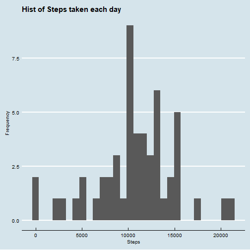
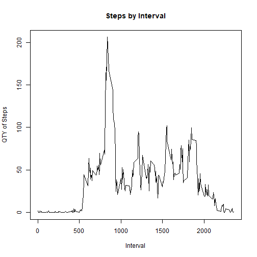
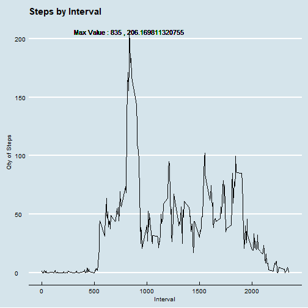
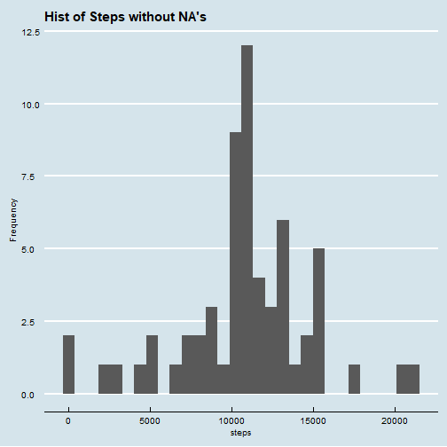
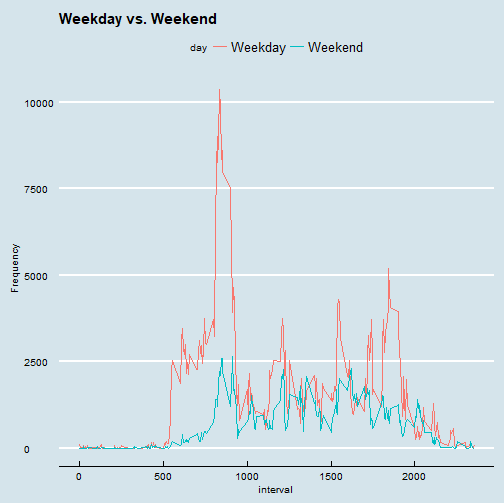
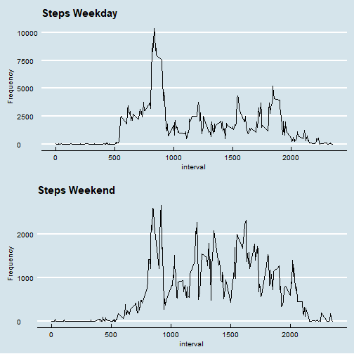

## Introduction

It is now possible to collect a large amount of data about personal movement using activity monitoring devices such as a Fitbit, Nike Fuelband, or Jawbone Up. These type of devices are part of the "quantified self" movement - a group of enthusiasts who take measurements about themselves regularly to improve their health, to find patterns in their behavior, or because they are tech geeks. But these data remain under-utilized both because the raw data are hard to obtain and there is a lack of statistical methods and software for processing and interpreting the data.

This assignment makes use of data from a personal activity monitoring device. This device collects data at 5 minute intervals through out the day. The data consists of two months of data from an anonymous individual collected during the months of October and November, 2012 and include the number of steps taken in 5 minute intervals each day.


### Setup


```r
library(ggplot2)
```

```
## Warning: package 'ggplot2' was built under R version 3.4.1
```

```r
library(knitr)
library(plyr)
library(dplyr)
```

```
## Warning: package 'dplyr' was built under R version 3.4.1
```

```
## 
## Attaching package: 'dplyr'
```

```
## The following objects are masked from 'package:plyr':
## 
##     arrange, count, desc, failwith, id, mutate, rename, summarise,
##     summarize
```

```
## The following objects are masked from 'package:stats':
## 
##     filter, lag
```

```
## The following objects are masked from 'package:base':
## 
##     intersect, setdiff, setequal, union
```

```r
library(lubridate)
```

```
## Warning: package 'lubridate' was built under R version 3.4.1
```

```
## 
## Attaching package: 'lubridate'
```

```
## The following object is masked from 'package:plyr':
## 
##     here
```

```
## The following object is masked from 'package:base':
## 
##     date
```

```r
library(tidyverse)
```

```
## Warning: package 'tidyverse' was built under R version 3.4.1
```

```
## Loading tidyverse: tibble
## Loading tidyverse: tidyr
## Loading tidyverse: readr
## Loading tidyverse: purrr
```

```
## Warning: package 'tibble' was built under R version 3.4.1
```

```
## Warning: package 'readr' was built under R version 3.4.1
```

```
## Warning: package 'purrr' was built under R version 3.4.1
```

```
## Conflicts with tidy packages ----------------------------------------------
```

```
## arrange():     dplyr, plyr
## as.difftime(): lubridate, base
## compact():     purrr, plyr
## complete():    tidyr, .GlobalEnv
## count():       dplyr, plyr
## date():        lubridate, base
## failwith():    dplyr, plyr
## filter():      dplyr, stats
## here():        lubridate, plyr
## id():          dplyr, plyr
## intersect():   lubridate, base
## lag():         dplyr, stats
## mutate():      dplyr, plyr
## rename():      dplyr, plyr
## setdiff():     lubridate, base
## summarise():   dplyr, plyr
## summarize():   dplyr, plyr
## union():       lubridate, base
```

```r
library(ggthemes)
```

```
## Warning: package 'ggthemes' was built under R version 3.4.2
```

```r
library(zoo)
```

```
## Warning: package 'zoo' was built under R version 3.4.1
```

```
## 
## Attaching package: 'zoo'
```

```
## The following objects are masked from 'package:base':
## 
##     as.Date, as.Date.numeric
```

```r
library(gridExtra)
```

```
## 
## Attaching package: 'gridExtra'
```

```
## The following object is masked from 'package:dplyr':
## 
##     combine
```


### 1. Code for reading in the dataset and/or processing the data and process the column as Date

```r
project1 <- read.csv2("activity.csv", header = TRUE, sep = ",")
project1$date <- ymd(project1$date)
```


### 2. Data to graph
1. The first steep is to make the sum of the steps using date as index.
2. The second steep is to put the names of the columns.
3. The third steep is to make the Histogram, in this case using GGPlot2


```r
Steps <- aggregate(project1$steps ~ project1$date, FUN = sum)
colnames(Steps) <- c("Date", "Steps")

ggplot(Steps, aes(x = Steps)) + 
  geom_histogram(stat = "bin") + 
  theme_economist() + 
  labs(y = "Frequency") + 
  ggtitle("Hist of Steps")
```

```
## `stat_bin()` using `bins = 30`. Pick better value with `binwidth`.
```




### 3. Mean and median number of steps taken each day

The values for mean and median are:


```r
mean(Steps$Steps)
```

```
## [1] 10766.19
```

```r
median(Steps$Steps)
```

```
## [1] 10765
```


### 4. Time series plot of the average number of steps taken

These are the time plots using the base and ggplot2


```r
daily_act <- project1 %>% filter(!is.na(steps))
steps_inter <- aggregate(steps ~ interval, daily_act, mean)

interval_wmax <- steps_inter[which.max(steps_inter$steps),1]
interval_value <- steps_inter[which.max(steps_inter$steps),2]

plot(steps_inter$interval, steps_inter$steps, type = "l", xlab = "Interval", ylab = "QTY of Steps", main = "Steps by Interval")
```



```r
ggplot(steps_inter, aes(x = interval, y = steps))+geom_line()+theme_economist()+labs(x = "Interval", y = "Qty of Steps")+ggtitle("Steps by Interval")+
    geom_text(aes(label = paste("Max Value :", as.character(interval_wmax), ",", as.character(interval_value), sep = " ")), x = interval_wmax, y = interval_value)
```




### 5. Find interval with most average steps.


```r
interval_wmax <- steps_inter[which.max(steps_inter$steps),1]
interval_value <- steps_inter[which.max(steps_inter$steps),2]
```


## Imputing missing values

### 1. Calculate and report the total number of missing values in the dataset (i.e. the total number of rows with NAs).


```r
nas <- sum(is.na(project1$steps))
paste("The total of NA's in the data are", nas, sep = " ")
```

```
## [1] "The total of NA's in the data are 2304"
```


### 2.- Devise a strategy for filling in all of the missing values in the dataset. 
My first strategy was to use a IF condition to replace the Days with Steps = NA but it did not fit what I was looking for.


### 3.- Create a new dataset that is equal to the original dataset but with the missing data filled in.


```r
project_wo_nas <- project1
nas_steps <- is.na(project_wo_nas$steps)
data_to_fill_nas <- tapply(project_wo_nas$steps, project_wo_nas$interval, mean, na.rm=TRUE, simplify=TRUE)
project_wo_nas$steps[nas_steps] <- data_to_fill_nas[as.character(project_wo_nas$interval[nas_steps])]
```


### 4.Make a histogram of the total number of steps taken each day and Calculate and report the mean and median total number of steps taken per day. 


```r
summ_wo_nas <- project_wo_nas %>% group_by(date) %>% summarize(steps = sum(steps))

ggplot(summ_wo_nas, aes(x = steps)) + 
  geom_histogram(stat = "bin") + 
  theme_economist() + 
  labs(y = "Frequency") + 
  ggtitle("Hist of Steps without NA's")
```

```
## `stat_bin()` using `bins = 30`. Pick better value with `binwidth`.
```



```r
mean(summ_wo_nas$steps)
```

```
## [1] 10766.19
```

```r
median(summ_wo_nas$steps)
```

```
## [1] 10766.19
```


### 5.Do these values differ from the estimates from the first part of the assignment? 

The mean and the median with the new data is equal but comparing the new data against the old data, we can see that the mean is the same but the median is different.


### 6.What is the impact of imputing missing data on the estimates of the total daily number of steps?

The new data came from the mean of the existing data, that is the reason that both mean's are the same but this is not the case with the median. We need to verify using the median insted of the mean to fill the data frame.


### 7.Are there differences in activity patterns between weekdays and weekends?

As we can see in the graphs, the activity during the workday is greater that during the weekends.


```r
data_with_day <- project_wo_nas
days_name <- c('Monday', 'Tuesday', 'Wednesday', 'Thursday', 'Friday')
data_with_day$day <- c('Weekend', 'Weekday')[(weekdays(data_with_day$date) %in% days_name)+1L]

data_by_day <- data_with_day %>% group_by(interval, day) %>% summarize(steps = sum(steps))
data_by_day_wd <- subset(data_by_day, data_by_day$day == "Weekday")
data_by_day_wk <- subset(data_by_day, data_by_day$day == 'Weekend')

ggplot(data_by_day, aes(x = interval, y = steps, color = day)) + 
  geom_line() + 
  theme_economist() + 
  labs(y = "Frequency") + 
  ggtitle("Weekday vs. Weekend")
```



```r
plot2 <- ggplot(data_by_day_wd, aes(x = interval, y = steps)) + 
  geom_line() + 
  theme_economist() + 
  labs(y = "Frequency") + 
  ggtitle("Steps Weekday")

plot3 <- ggplot(data_by_day_wk, aes(x = interval, y = steps)) + 
  geom_line() + 
  theme_economist() + 
  labs(y = "Frequency") + 
  ggtitle("Steps Weekend")

grid.arrange(plot2, plot3, ncol = 1)
```


